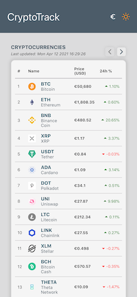
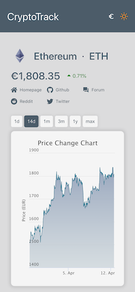

# Crypto Track App

A React+Typescript based SPA to track cryptocurrencies and observe price changes
along with price chart and general statistics.

## Demo - Screens

### desktop version

### mobile version

## Description

CryptoTrack app has been developed in React framework with Typescript,
using [Styled Components](https://styled-components.com/), [Redux](https://redux.js.org/) and [React Hooks](https://reactjs.org/docs/hooks-intro.html).
It consumes the external API of [CoinGecko](https://www.coingecko.com/en/api).

The basic functionalities are the following:

*  Listing all the available cryptocurrencies in paginated view with the following info:
    * name
    * symbol
    * current price
    * highest price in the last 24 hours
    * lower price in the last 24 hours
    * price change in percentage of the last 24 hours
*   Accessing details of a specific crypto in a separate page, eg:
    * Current price
    * Coin Graph
    * Price changes
    * Description
    * Reputation score
    * Statistics (social, developer, price changes)
*   Redirect to error page if something goes wrong.

In addition, the following features have been implemented:

* Change of currency between USD($) and EURO(€)
* Change of theme between dark and light
* Fetching crypto list in interval of 30sec
* Skeleton ui overlay while loading data
* Responsive layout (mobile, tablet, laptop, big screens)
* Unit testing with RTL
* SEO integration & accessibility rules applied

## Project structure

    .
    ├── src
    |   |── components                  # generic components used
    |   |   |──  Layout                 # component folder
    |   |   |    |── Layout.tsx         # main component
    |   |   |    |── index.ts           # index file of component
    |   |   |    |── styled.ts          # styled components file
    |   |   |── ...
    |   |── screens                     # screens of the app
    |   |   |──  CoinsList              # component folder
    |   |   |    |── components         # child components
    |   |   |        |──  Layout        # child component folder
    |   |   |        |──  ...           
    |   |   |    |── CoinsList.tsx      # main component
    |   |   |    |── CoinsList.test.tsx # unit test file
    |   |   |    |── index.ts           # index file of component
    |   |   |    |── styled.ts          # styled components file
    |   |   |── ...
    |   |── store                       # redux store, reducers, actions,...
    |   |   |── ...
    |   |── constants                   # constants folder
    |   |   |── ...  
    |   |── utils                       # utils folder
    |   |   |── testing                 # testing folder
    |   |   |── localStore              # localStore folder
    |   |── App.tsx                     # main App
    |   |── App.test.tsx                # main App test file
    |   |── index.tsx                   # index.tsx init file
    |   |── ...
    |   ├── ...
    |   |
    │   README.md                       # README file
    |   .eslintrc                       # eslint conf
    |   .prettierrc                     # prettier conf
    |   package.json                    # package.json
    └── ...

> [React-icons](https://react-icons.github.io/react-icons/) package is used for icons styling.

#### Technologies Used

In this project, **React** v17.0.2 was used with **Typescript** along with [Redux](https://redux.js.org/),
implementing [Hooks](https://react-redux.js.org/next/api/hooks).

The basic idea is to use a store that handles a global state (for theme and currency) and 2 separate states: one for coin details, and the other for coins list.
It uses actions, reducers and a middleware(**thunk**) in order to utilize API fetch calls as actions. On top of that, selectors are being used as well in order to access state easily.

To help with the **immutability**, [immerjs](https://immerjs.github.io/immer/) library is used. 

Controlling the **loading** state, [react-placeholder](https://github.com/buildo/react-placeholder) library is used 
to show skeletons ui elements in the table of coin list and in coin details sections.

For the application's charts, [HighCharts](https://www.highcharts.com/docs/index) library (with a react-wrapper helper) was used to have interactive charts in coin details page.

#### Styled Components - Responsive layout

Regarding the styles used, the methodology in this project is to have a styled.ts file 
that will contain the styles of the current component. If the styles are limited to 1-3 per component,
then they are being place inside the component itself.

In order to have responsive layout of the whole app, CSS Grid and Flex Layout has
been used across the application, along with a queries constant that has device specific
widths for media queries.

### Testing with [Jest](https://jestjs.io/) & [React Testing Library](https://testing-library.com/)

Unit tests are created along with the component in a .test.ts* file. The coverage of the app is **~100%**

### Installation

``git clone https://github.com/antska/crypto-track.git``

``cd crypto-track``

``yarn install``

``yarn start``

### Running the tests

``cd crypto-track``

``yarn test``

``yarn lint`` (optionally)

